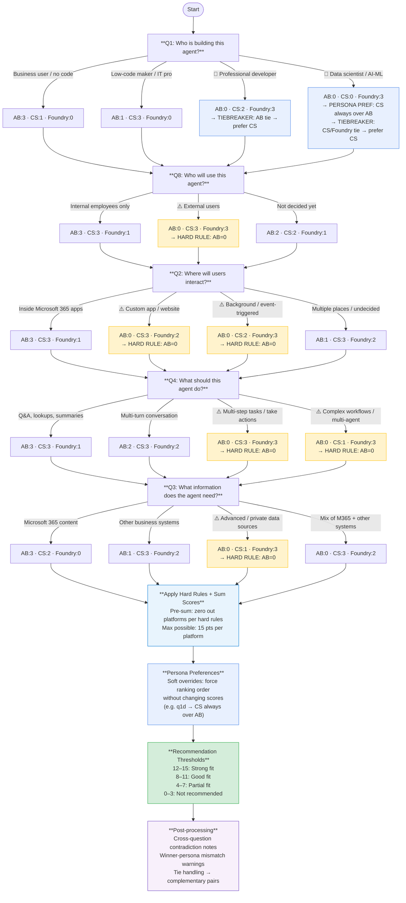

```mermaid
flowchart TD
    START([Start]) --> Q1

    Q1["**Q1: Who is building this agent?**"]
    Q1 -->|Business user / no code| Q1A["AB:3 · CS:1 · Foundry:0"]
    Q1 -->|Low-code maker / IT pro| Q1B["AB:1 · CS:3 · Foundry:0"]
    Q1 -->|"🔀 Professional developer"| Q1C["AB:0 · CS:2 · Foundry:3\n→ TIEBREAKER: AB tie → prefer CS"]
    Q1 -->|"🔀 Data scientist / AI-ML"| Q1D["AB:0 · CS:0 · Foundry:3\n→ PERSONA PREF: CS always over AB\n→ TIEBREAKER: CS/Foundry tie → prefer CS"]

    Q1A & Q1B & Q1C & Q1D --> Q8

    Q8["**Q8: Who will use this agent?**"]
    Q8 -->|Internal employees only| Q8A["AB:3 · CS:3 · Foundry:1"]
    Q8 -->|"⚠️ External users"| Q8B["AB:0 · CS:3 · Foundry:3\n→ HARD RULE: AB=0"]
    Q8 -->|Not decided yet| Q8D["AB:2 · CS:2 · Foundry:1"]

    Q8A & Q8B & Q8D --> Q2

    Q2["**Q2: Where will users interact?**"]
    Q2 -->|Inside Microsoft 365 apps| Q2A["AB:3 · CS:3 · Foundry:1"]
    Q2 -->|"⚠️ Custom app / website"| Q2B["AB:0 · CS:3 · Foundry:2\n→ HARD RULE: AB=0"]
    Q2 -->|"⚠️ Background / event-triggered"| Q2C["AB:0 · CS:2 · Foundry:3\n→ HARD RULE: AB=0"]
    Q2 -->|Multiple places / undecided| Q2D["AB:1 · CS:3 · Foundry:2"]

    Q2A & Q2B & Q2C & Q2D --> Q4

    Q4["**Q4: What should this agent do?**"]
    Q4 -->|Q&A, lookups, summaries| Q4A["AB:3 · CS:3 · Foundry:1"]
    Q4 -->|Multi-turn conversation| Q4B["AB:2 · CS:3 · Foundry:2"]
    Q4 -->|"⚠️ Multi-step tasks / take actions"| Q4C["AB:0 · CS:3 · Foundry:3\n→ HARD RULE: AB=0"]
    Q4 -->|"⚠️ Complex workflows / multi-agent"| Q4D["AB:0 · CS:1 · Foundry:3\n→ HARD RULE: AB=0"]

    Q4A & Q4B & Q4C & Q4D --> Q3

    Q3["**Q3: What information does the agent need?**"]
    Q3 -->|Microsoft 365 content| Q3A["AB:3 · CS:2 · Foundry:0"]
    Q3 -->|"Other business systems"| Q3B["AB:1 · CS:3 · Foundry:2"]
    Q3 -->|"⚠️ Advanced / private data sources"| Q3C["AB:0 · CS:1 · Foundry:3\n→ HARD RULE: AB=0"]
    Q3 -->|Mix of M365 + other systems| Q3D["AB:0 · CS:3 · Foundry:2"]

    Q3A & Q3B & Q3C & Q3D --> SCORE

    SCORE["**Apply Hard Rules + Sum Scores**\nPre-sum: zero out platforms per hard rules\nMax possible: 15 pts per platform"]

    SCORE --> PREF["**Persona Preferences**\nSoft overrides: force ranking order\nwithout changing scores\n(e.g. q1d → CS always over AB)"]

    PREF --> RESULT["**Recommendation Thresholds**\n12–15: Strong fit\n8–11: Good fit\n4–7: Partial fit\n0–3: Not recommended"]

    RESULT --> NOTES["**Post-processing**\nCross-question contradiction notes\nWinner-persona mismatch warnings\nTie handling → complementary pairs"]

    style Q1C fill:#e8f0fe,stroke:#4a86e8
    style Q1D fill:#e8f0fe,stroke:#4a86e8
    style Q8B fill:#fff3cd,stroke:#ffc107
    style Q2B fill:#fff3cd,stroke:#ffc107
    style Q2C fill:#fff3cd,stroke:#ffc107
    style Q4C fill:#fff3cd,stroke:#ffc107
    style Q4D fill:#fff3cd,stroke:#ffc107
    style Q3C fill:#fff3cd,stroke:#ffc107
    style SCORE fill:#e8f4fd,stroke:#0078D4
    style PREF fill:#e8f0fe,stroke:#4a86e8
    style RESULT fill:#d4edda,stroke:#28a745
    style NOTES fill:#f8f0fb,stroke:#6f42c1
```
