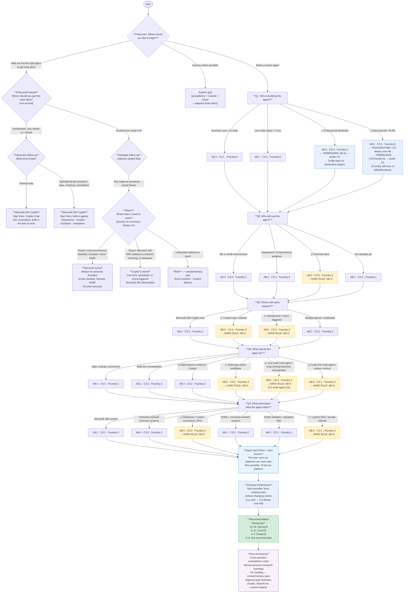

## Optional constraints (scored path only)

After Q3 (last scored question), users may multi-select enterprise constraints or skip. Soft boosts apply in `rankPlatforms` before results. Entry-point and legacy fast-track paths skip this step.
